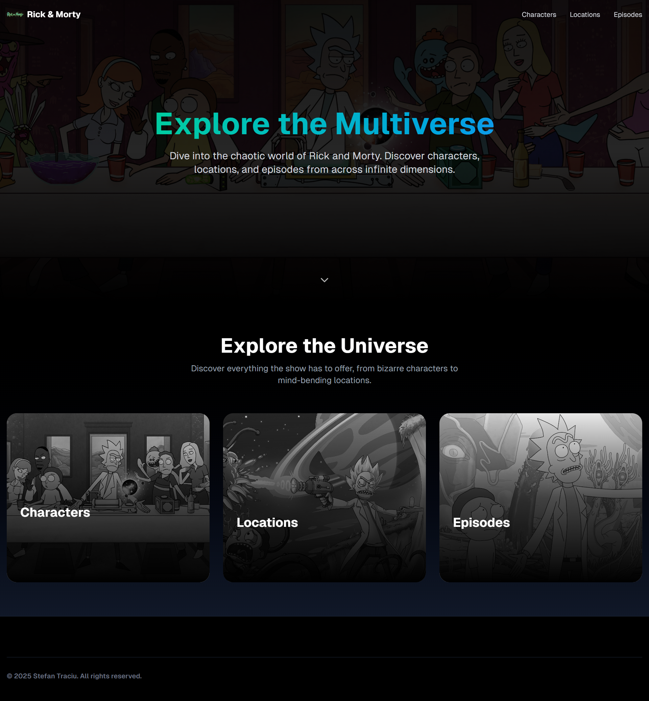
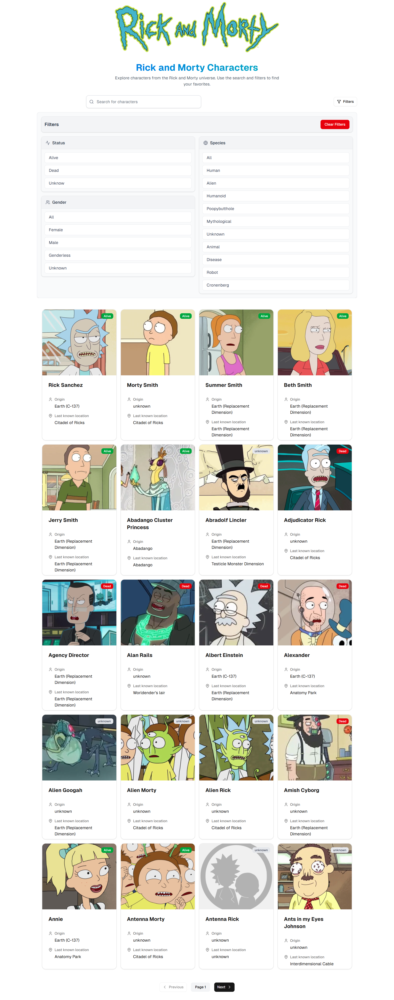

# Rick and Morty Explorer 🚀👽

[Live Demo](https://rickandmortyuniverse-iota.vercel.app/)

## Description

Dive into the multiverse of Rick and Morty! This Next.js web application provides a user-friendly interface to explore detailed information about your favorite characters, episodes, and locations from the hit animated series. Powered by the official Rick and Morty API, it offers a seamless and visually appealing way to discover everything the show has to offer. Get schwifty!

## Screenshot



<div align="center">
   <table>
      <tr>
         <td align="center">
            
            <p>Characters Page</p>
         </td>
         <td align="center">
            
            <p>Episodes Page</p>
         </td>
         <td align="center">
            
            <p>Locations Page</p>
         </td>
      </tr>
   </table>
</div>

## Table of Contents

- [Features](#features)
- [Installation](#installation)
- [Usage](#usage)
- [License](#license)

## Features

- **Character Exploration with Filtering:** Dive deep into character details and utilize powerful filtering options to find specific characters based on their attributes.
- **Episode Character Lists:** Quickly identify all the characters featured in any given Rick and Morty episode.
- **Location Resident Directory:** Discover which characters reside in or have been associated with specific locations throughout the multiverse.

## Installation

To get started with the project, follow these steps:

1. Clone the repository:
   ```bash
   git clone https://github.com/yourusername/rickandmorty-next.git
   ```
2. Navigate to the project directory:
   ```bash
   cd rickandmorty-next
   ```
3. Install the dependencies:
   ```bash
   npm install
   ```

## Usage

To run the development server, use the following command:

```bash
npm run dev
```

Open [http://localhost:3000](http://localhost:3000) with your browser to see the result.

## License

This project is licensed under the MIT License. See the [LICENSE](LICENSE) file for more details.
